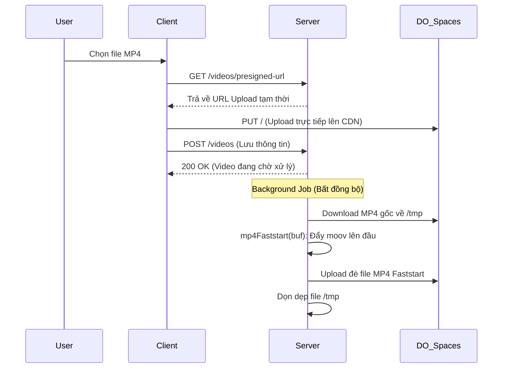

# Kiến trúc Hệ thống & Kỹ thuật Xuyên suốt Dự án We Watch

Tài liệu này cung cấp cái nhìn chuyên sâu (Deep Dive) vào kiến trúc tổng thể, sơ đồ luồng dữ liệu, và các giải pháp kỹ thuật đã được tối ưu hóa cho hệ thống xem chung video (Watch Party) thời gian thực của dự án We Watch.

---

## 1. Tổng quan Hệ thống (System Architecture Overview)

Hệ thống được thiết kế theo hướng **Event-Driven** và **Real-time**, tách biệt hoàn toàn luồng xử lý Media (Video/Audio WebRTC) và luồng Dữ liệu trạng thái (State Data).

```mermaid
graph TD
    Client[Client (Next.js)]
    Backend[Server (NestJS)]
    DB[(PostgreSQL)]
    Cache[(Redis)]
    CDN[DigitalOcean Spaces S3]
    LiveKit[LiveKit WebRTC Server]

    Client -- API (HTTP) --> Backend
    Client -- Socket.io (WSS) --> Backend
    Client -- WebRTC --> LiveKit
    Client -- Stream MP4/HLS --> CDN

    Backend -- Prisma --> DB
    Backend -- Pub/Sub & Caching --> Cache
    Backend -- Presigned URL / Background Upload --> CDN
```

### Các Thành phần Chính:
1. **Frontend (Next.js)**: Sử dụng React Hooks tuỳ chỉnh (`useSocket`, `useNTP`) kết hợp `hls.js` cho trình phát video tùy chỉnh. TailwindCSS đảm bảo giao diện thích ứng.
2. **Backend (NestJS)**: Cung cấp RESTful API và Websocket Gateway. Quản lý xác thực (JWT), kết nối CSDL và xử lý các tác vụ nền (Background Jobs).
3. **Storage & CDN (DO Spaces)**: Lưu trữ Object Storage tương thích S3. CDN (Content Delivery Network) phân phối file tĩnh giúp load video nhanh trên toàn cầu.
4. **Redis**: Đóng vai trò là "Single Source of Truth" tạm thời cho trạng thái phòng (Video State, Chat Mute, Wishlist) và xử lý cơ chế Pub/Sub cho hệ thống phân tán (nếu scale up).
5. **LiveKit**: Máy chủ SFU (Selective Forwarding Unit) chuyên biệt xử lý luồng Video/Audio Camera của người dùng với độ trễ < 50ms.

---

## 2. Đường ống Xử lý Video (Video Processing & Faststart Pipeline)

Việc xử lý video dung lượng lớn trên máy chủ Node.js dễ gây nghẽn cổ chai (Bottleneck). Dự án đã giải quyết bằng luồng upload trực tiếp và kỹ thuật **Pure JS Faststart**.

### Sơ đồ Luồng Upload và Tối ưu



### Kỹ thuật Pure JS Faststart (Không phụ thuộc FFmpeg)
Định dạng MP4 được cấu tạo từ các khối gọi là **Atoms** (hoặc Boxes).
- `ftyp`: Định dạng file.
- `mdat`: Dữ liệu video/audio nguyên thủy (rất nặng).
- `moov`: Siêu dữ liệu (Metadata) chứa bảng chỉ mục từng frame hình.

Theo mặc định, trình quay phim thường nối đuôi `moov` vào cuối file sau khi ghi xong `mdat`. Điều này bắt trình duyệt tải toàn bộ file mới phát được.
Hàm `mp4Faststart` trong dự án hoạt động như sau:
1. Đọc file dưới dạng nhị phân (`Buffer`).
2. Quét qua cấu trúc để xác định offset và size của `moov` và `mdat`.
3. Tách `moov` ra và tính toán lại toàn bộ các con trỏ bộ nhớ bên trong `moov` (`stco` cho 32-bit offset, `co64` cho 64-bit offset) bằng cách cộng thêm `moov.size` vào từng offset.
4. Nối Buffer theo thứ tự mới: `[ftyp] + [moov] + [mdat]`.
> **Kết quả:** Xử lý file 500MB chỉ trong ~1-2 giây bằng RAM, hoàn toàn không cần giải mã/mã hóa lại (re-encode) như FFmpeg, tiết kiệm tài nguyên Server tối đa. Trình duyệt có thể phát và seek video ngay lập tức (Range Requests).

---

## 3. Cơ chế Đồng bộ Thời gian thực (Real-time Video Sync)

### 3.1. Đồng bộ Đồng hồ (NTP-Lite Synchronization)
Thời gian giữa các thiết bị trên mạng không bao giờ trùng khớp tuyệt đối. Để đồng bộ trạng thái chính xác tới mili-giây, hệ thống tự triển khai thuật toán NTP-Lite:

**Công thức Toán học:**
Khi kết nối Socket, Client ghi lại $T_0$, Server nhận lúc $T_1$, Server trả lời lúc $T_2$, Client nhận lúc $T_3$.
- Round Trip Time (Độ trễ khứ hồi):  
  $$RTT = (T_3 - T_0) - (T_2 - T_1)$$
- Server Time Offset (Độ lệch đồng hồ):  
  $$Offset = \frac{(T_1 - T_0) + (T_2 - T_3)}{2}$$

Mỗi khi gửi lệnh Video (Play/Pause), Client sẽ gắn kèm thời gian thực của Server:
```typescript
sentAt: Date.now() + serverTimeOffset
```
Người nhận sẽ biết chính xác lệnh này được phát ra từ bao lâu trước đây trong thế giới thực.

### 3.2. Thuật toán Chasing (Bám đuổi) bằng Playback Rate
Thay vì ép người xem nhảy cóc (Hard-Seek) mỗi khi mạng lag (gây khựng hình mất trải nghiệm), hệ thống phân loại độ lệch (`diff`) để xử lý:

```mermaid
graph LR
    A[Nhận lệnh Sync/Play] --> B{Tính độ lệch (diff)}
    B -- Lệch < 0.5s --> C[Chỉ gọi Play, Không can thiệp]
    B -- 0.5s <= Lệch <= 2s --> D[Soft Sync: PlaybackRate = 1.05 / 0.95]
    B -- Lệch > 2s --> E[Hard Sync: currentTime = targetTime]
    D --> F[Sau khi bù đủ thời gian, trả về Rate = 1.0]
```
- **Ví dụ:** Host đang ở `10:00`, Client B đang ở `09:00` (Lệch 1s). Client B sẽ được phát ở tốc độ `1.05x` (nhanh hơn 5%). Sau 20 giây ($20 \times 0.05 = 1s$), Client B sẽ bắt kịp Host hoàn toàn tự nhiên mà mắt thường khó nhận ra.

### 3.3. Xử lý "Seek Loop" Conflict
Trình duyệt có các sự kiện native như `onSeeked` tự động kích hoạt sau khi `currentTime` thay đổi. 
- **Lỗi kinh điển:** Host Pause $\rightarrow$ Client nhận lệnh Pause $\rightarrow$ Client cập nhật `currentTime` để đồng bộ $\rightarrow$ Trình duyệt client hiểu là "Vừa tua xong" $\rightarrow$ Bắn sự kiện `onSeeked` $\rightarrow$ Client tự động Play trở lại.
- **Giải pháp:** 
  - Loại bỏ hoàn toàn sự kiện ép buộc Play ngầm trong `onSeeked`. 
  - Đưa cờ `ignoreNextEvent.current` vào để trình phát tự nhận biết đâu là hành động thủ công từ con người (cần broadcast cho server) và đâu là hành động tự động hóa từ Code (cần im lặng thi hành).

---

## 4. Quản lý Trạng thái Phòng & Bảo mật (Room State & Moderation)

Hệ thống sử dụng **Redis** làm Memory DB trung tâm để giải quyết bài toán Socket đứt kết nối và đa người dùng truy cập.

### Cấu trúc Dữ liệu trên Redis
- **Trạng thái Video** (`room:video_state:{roomId}`): 
  - `isPlaying: boolean`
  - `currentTime: number`
  - `lastUpdated: timestamp`
  (Dữ liệu này phục vụ cho những người dùng mới (Late joiners) có thể lấy ngay trạng thái đang phát mà không cần hỏi Host).
- **Hệ thống Cấm Chat (Mute)** (`chat:mute:{roomId}:{username}`): 
  - `mutedUntil: timestamp`
  - `mutedBy: string`

### Luồng Kiểm duyệt Chat
1. Host/Admin gọi lệnh `muteChatUser("userA", 5_minutes)`.
2. Backend lưu vào Redis với `TTL = 300s`, đồng thời broadcast sự kiện `userMuted` để các Client khác cập nhật UI.
3. Nếu User A cố tình gửi tin nhắn, tầng Gateway sẽ check Redis:
   ```typescript
   const muteData = await this.redis.get(CHAT_MUTE_KEY);
   if (muteData) return client.emit('chatMuted', remainingTime);
   ```
4. Tin nhắn bị chặn hoàn toàn ở tầng Backend, không bao giờ được phát tán.

---

## 5. Kiến trúc Micro-Interactions trên UI

- **Emoji Bay (Floating Emojis)**: Thay vì lưu vào DB, các Emoji reaction là sự kiện Transient (chớp nhoáng). Khi User bấm tim, socket bắn tọa độ `x` (ngẫu nhiên) kèm ID người gửi. Component `FloatingEmojis` sử dụng `Framer Motion` để render chuỗi hạt (particles) trôi lên mượt mà ở độ phân giải 60 FPS, sau đó tự hủy DOM element khỏi bộ nhớ.
- **Tách biệt LiveKit**: Hệ thống Camera của các thành viên được LiveKit SDK đóng gói trong `<LiveKitRoom>`. Việc tắt/mở Mic/Cam đi thẳng qua tín hiệu WebRTC của máy chủ LiveKit, không làm nặng kênh truyền Websocket của hệ thống chính. Trạng thái Media của Host (`hostMediaState`) mới được đồng bộ qua Websocket để UI phản hồi.

---

## 6. Tối ưu hóa Trải nghiệm Người dùng (Performance & UX Optimization)

Hệ thống được tối ưu hóa ở mức cao nhất để đảm bảo mượt mà ngay cả trên thiết bị cấu hình thấp hoặc mạng yếu:

### a. Tránh "Nghẽn cổ chai" DOM với React Virtuoso
- **Vấn đề:** Trong phòng Community, nếu hàng ngàn người chat cùng lúc, DOM sẽ chứa hàng ngàn node, làm sập trình duyệt.
- **Giải pháp:** Sử dụng **Virtualization (Danh sách ảo)** bằng thư viện `react-virtuoso`. Khung chat chỉ render chính xác những phần tử nằm trong tầm nhìn (viewport) của người dùng. Khi cuộn, các DOM Node cũ sẽ bị tái sử dụng thay vì tạo mới, giúp FPS luôn đạt 60.

### b. Debounce Socket khi Tua Video (Drag-to-Seek)
- **Vấn đề:** Nếu gửi sự kiện Socket `seek` liên tục mỗi khi người dùng kéo thanh tiến trình, máy chủ sẽ bị Spam hàng trăm Request/s.
- **Giải pháp:** Tách biệt UI State và Network State.
  - Khi người dùng giữ chuột (`onPointerDown`) và kéo (`onPointerMove`), chỉ cập nhật thanh tiến trình ở Local UI (giúp thao tác mượt, không có độ trễ).
  - Khi người dùng nhả chuột (`onPointerUp`), hệ thống mới đóng gói đúng 1 sự kiện `seek` kèm theo Timestamp NTP để gửi lên Server.

### c. Tối ưu Băng thông WebRTC (Adaptive Stream)
- Tích hợp `adaptiveStream` và `dynacast` trên thư viện LiveKit.
- Hệ thống máy chủ SFU (Selective Forwarding Unit) sẽ tự động nhận diện thiết bị người dùng đang xem ở khung hình to hay nhỏ, hoặc có cuộn Camera đi khuất khỏi màn hình hay không.
- SFU sẽ tự động hạ chất lượng luồng Video truyền về (từ 1080p xuống 160p) hoặc tạm ngưng stream đối với những người dùng đang bị ẩn, giúp tiết kiệm lên tới 80% RAM và Bandwidth.
