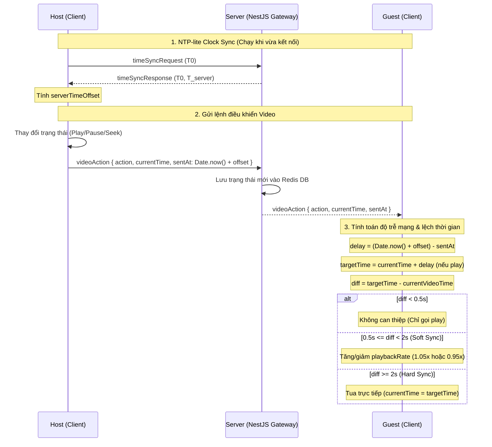

# Cơ chế Đồng bộ Video Thời gian thực (Real-time Video Sync)

Tài liệu này giải thích chi tiết cơ chế đồng bộ trạng thái phát video trong phòng xem chung (Watch Party) thời gian thực của dự án **We Watch**.

Hệ thống đồng bộ được chia thành 3 phần cốt lõi:
1. **Đồng bộ đồng hồ (NTP-Lite Synchronization)** để quy đổi thời gian của mọi thiết bị về một múi giờ chuẩn của Server.
2. **Thuật toán bám đuổi (Chasing) bằng Playback Rate** để triệt tiêu độ lệch nhỏ mà không cần seek làm giật hình.
3. **Cơ chế chống vòng lặp tua (Seek Loop Conflict)** bằng cờ hiệu `ignoreNextEvent` nhằm lọc bỏ các sự kiện tự động kích hoạt bởi code.

---

## Sơ đồ kiến trúc tổng quan luồng sự kiện Video



---

## 1. Đồng bộ Đồng hồ (NTP-Lite Synchronization)

### 📌 Tại sao cần thiết?
Đồng hồ phần cứng trên thiết bị của mỗi người dùng (Host và Guest) luôn bị lệch pha nhau (Clock Drift) do chênh lệch múi giờ, độ trễ cập nhật thời gian từ hệ điều hành, v.v. Nếu chỉ truyền trực tiếp thời gian của Host, Guest sẽ không thể biết chính xác lệnh đó đã được phát ra cách đây bao lâu.

### 🛠️ Thuật toán NTP-Lite
Hệ thống tự triển khai một biến thể gọn nhẹ của giao thức NTP (Network Time Protocol) để tìm ra **Server Time Offset** ($\text{Offset}$) giữa Client và Server.

#### Công thức toán học:
Khi Client gửi yêu cầu đồng bộ
1. $T_0$: Thời điểm Client gửi yêu cầu (Client Time).
2. $T_1$: Thời điểm Server nhận yêu cầu và $T_2$: Thời điểm Server phản hồi ($T_1 \approx T_2 \approx T_{\text{server}}$).
3. $T_3$: Thời điểm Client nhận được phản hồi (Client Time).

* **RTT (Round Trip Time - Độ trễ khứ hồi):**
  $$RTT = (T_3 - T_0) - (T_2 - T_1) \approx T_3 - T_0$$
* **Server Time Offset (Độ lệch thời gian của Server so với Client):**
  $$\text{Offset} = T_{\text{server}} - \left(T_0 + \frac{RTT}{2}\right)$$
  *(Giả định thời gian truyền tin đi và về là bằng nhau và bằng $RTT / 2$)*

#### Code triển khai thực tế:

**Server-side** (file [room.gateway.ts](file:///Users/mjhtuu/Desktop/thư%20mục%20không%20có%20tiêu%20đề%202/we_wactch/we-wactch-server/src/room/room.gateway.ts#L715-L724)):
```typescript
@SubscribeMessage('timeSyncRequest')
handleTimeSync(
    @ConnectedSocket() client: Socket,
    @MessageBody() data: { clientSendTime: number },
) {
    client.emit('timeSyncResponse', {
        clientSendTime: data.clientSendTime, // T0
        serverTime: Date.now(), // T_server (T1 ~ T2)
    });
}
```

**Client-side** (file [useSocket.ts](file:///Users/mjhtuu/Desktop/thư%20mục%20không%20có%20tiêu%20đề%202/we_wactch/we-watch-client/src/hooks/useSocket.ts#L116-L135)):
*Để giảm nhiễu do biến động đường truyền, client gửi liên tục 3 gói tin cách nhau 200ms khi vừa kết nối rồi lấy giá trị trung bình:*
```typescript
// 1. Gửi request 3 vòng
timeSyncSamples.current = [];
for (let i = 0; i < 3; i++) {
  setTimeout(() => {
    socket.emit('timeSyncRequest', { clientSendTime: Date.now() });
  }, i * 200);
}

// 2. Nhận phản hồi và tính trung bình cộng Offset
socket.on('timeSyncResponse', (data: { clientSendTime: number; serverTime: number }) => {
  const now = Date.now();
  const rtt = now - data.clientSendTime; // T3 - T0
  const offset = data.serverTime - (data.clientSendTime + rtt / 2); // T_server - (T0 + RTT/2)
  timeSyncSamples.current.push(offset);

  if (timeSyncSamples.current.length >= 3) {
    const avg = timeSyncSamples.current.reduce((a, b) => a + b, 0) / timeSyncSamples.current.length;
    setServerTimeOffset(Math.round(avg));
  }
});
```

Sau khi có `serverTimeOffset`, mọi sự kiện phát đi từ Host đều được đóng gói kèm timestamp đã chuẩn hóa:
```typescript
sentAt: Date.now() + serverTimeOffset // NTP-corrected timestamp
```

---

## 2. Thuật toán Chasing (Bám đuổi) bằng Playback Rate

### 📌 Tại sao cần thiết?
Khi đường truyền mạng của người xem bị chập chờn, video của họ có thể bị chậm hơn Host từ 0.5s đến 1.5s. Nếu liên tục dùng cơ chế tua (Hard-Seek) để bắt kịp Host:
* Video sẽ liên tục bị đứng hình (buffering) để nhảy giây.
* Âm thanh bị vấp.
* Phá hỏng hoàn toàn trải nghiệm xem phim mượt mà.

### 🛠️ Giải pháp: Chasing bằng Playback Rate
Thay vì bắt nhảy cóc, ta điều chỉnh tốc độ phát (`playbackRate`) tăng 5% hoặc giảm 5% để người xem đuổi kịp Host một cách tự nhiên mà tai và mắt thường không nhận ra.

#### Cơ chế tính toán độ lệch:
Khi Guest nhận được sự kiện điều khiển từ Host (qua socket), Guest sẽ tính toán vị trí đáng lẽ video của Host đang phát ở thời điểm thực tế hiện tại:
*Tại [VideoPlayer.tsx:L202-L237](file:///Users/mjhtuu/Desktop/thư%20mục%20không%20có%20tiêu%20đề%202/we_wactch/we-watch-client/src/components/videos/VideoPlayer.tsx#L202-L237):*
```typescript
const now = Date.now() + serverTimeOffset; // Thời gian server hiện tại quy đổi ở Client
const delay = (now - lastAction.sentAt) / 1000; // Độ trễ truyền gói tin mạng (giây)

// Thời gian video thực tế Host đang chiếu ở thời điểm hiện tại
const targetTime = lastAction.currentTime + (lastAction.action === 'play' ? delay : 0);

// Độ lệch giữa Guest và Host
const diff = targetTime - v.currentTime; 
```

Hệ thống phân chia xử lý dựa trên khoảng giá trị của `diff`:

1. **Lệch nhỏ ($\text{diff} < 0.5\text{s}$): Chỉ phát video, không can thiệp**
   Sự sai lệch không đáng kể, không cần điều chỉnh tốc độ.
   ```typescript
   if (Math.abs(diff) < 0.5) {
       v.play().catch(() => {});
   }
   ```

2. **Lệch vừa ($0.5\text{s} \le \text{diff} < 2\text{s}$): Soft Sync (Đuổi kịp mượt mà)**
   * Nếu Guest chạy chậm hơn Host ($\text{diff} > 0$): Chạy nhanh hơn ở mức **`1.05x`**.
   * Nếu Guest chạy nhanh hơn Host ($\text{diff} < 0$): Chạy chậm lại ở mức **`0.95x`**.
   
   *Cách tính thời gian điều chỉnh:*
   Để bù đắp hết khoảng lệch `diff` (giây) với độ lệch tốc độ $\pm 0.05$ (5%), thời gian cần phát ở tốc độ mới là:
   $$\text{Thời gian bù} = \frac{|\text{diff}|}{0.05} \text{ (giây)} = \frac{|\text{diff}| \times 1000}{0.05} \text{ (ms)}$$
   
   Sau thời gian này, một bộ hẹn giờ `setTimeout` sẽ trả `playbackRate` về lại `1.0`:
   ```typescript
   v.play().catch(() => {});
   const rate = diff > 0 ? 1.05 : 0.95;
   v.playbackRate = rate;

   if (rateAdjustTimer.current) clearTimeout(rateAdjustTimer.current);
   rateAdjustTimer.current = setTimeout(() => {
       if (ref.current) ref.current.playbackRate = 1.0;
   }, (Math.abs(diff) * 1000) / 0.05);
   ```

3. **Lệch lớn ($\text{diff} \ge 2\text{s}$): Hard Sync (Tua trực tiếp)**
   Sự sai lệch quá lớn (do mất mạng lâu hoặc vừa vào phòng), soft sync sẽ mất quá nhiều thời gian để bù. Bắt buộc phải seek thẳng video:
   ```typescript
   v.currentTime = targetTime;
   v.play().catch(() => {});
   ```

---

## 3. Xử lý "Seek Loop" Conflict

### 📌 Lỗi vòng lặp sự kiện (Event Loop Cascading)
Trình duyệt có các sự kiện tự nhiên (native events) như `onPlay`, `onPause`, và `onSeeked` gắn trực tiếp vào thẻ `<video>`.
* Khi Guest nhận lệnh Pause từ Host thông qua socket, code của Client sẽ chạy dòng:
  ```typescript
  v.currentTime = lastAction.currentTime; // Gán thời gian phát
  v.pause(); // Tạm dừng
  ```
* Việc gán `v.currentTime` bằng code sẽ làm trình duyệt hiểu là video vừa được tua và tự động kích hoạt sự kiện native `onSeeked`/`onPause`.
* Nếu Guest không có cơ chế lọc, trình nghe sự kiện `onPause`/`onSeeked` của Guest sẽ lầm tưởng đây là do người xem chủ động nhấn nút tua/tạm dừng trên giao diện màn hình $\rightarrow$ Tự động gửi ngược sự kiện `seek`/`pause` lên server.
* Vòng lặp phản hồi vô tận này khiến video của cả phòng bị giật cục, dừng đột ngột hoặc nhảy loạn xạ.

### 🛠️ Giải pháp: Cờ hiệu `ignoreNextEvent`
Dự án sử dụng một biến ref cản đường `ignoreNextEvent = useRef(false)` để đánh dấu những thay đổi do chính code tạo ra.

*Tại [VideoPlayer.tsx](file:///Users/mjhtuu/Desktop/thư%20mục%20không%20có%20tiêu%20đề%202/we_wactch/we-watch-client/src/components/videos/VideoPlayer.tsx):*

#### Bước 1: Đánh dấu trước khi thay đổi trạng thái bằng Code
Mỗi khi nhận lệnh từ Socket và chuẩn bị thay đổi thuộc tính thẻ video, Client bật cờ lên `true`:
```typescript
// Khi nhận videoAction từ socket:
ignoreNextEvent.current = true;
v.currentTime = targetTime;
v.play().catch(() => {});

// Hoặc khi Host tự click nút điều khiển của riêng mình (chỉ gửi đi 1 lần):
ignoreNextEvent.current = true;
if (newPlaying) v.play();
else v.pause();
onAction?.(newPlaying ? 'play' : 'pause', v.currentTime);
```

#### Bước 2: Kiểm tra cờ trong các Handler Sự kiện Native
Khi các sự kiện native `onPlay`, `onPause` được trình duyệt kích hoạt, code sẽ kiểm tra trạng thái cờ:
```typescript
const handlePlay = () => {
  setPlaying(true);
  if (!ignoreNextEvent.current) {
    // Chỉ gửi socket lên server nếu đây là hành động thủ công từ Client (cờ = false)
    onAction?.('play', ref.current?.currentTime || 0);
  }
  // Reset cờ về lại false cho các sự kiện tiếp theo
  ignoreNextEvent.current = false;
};

const handlePause = () => {
  setPlaying(false);
  if (!ignoreNextEvent.current) {
    // Chỉ gửi socket lên server nếu đây là hành động thủ công từ Client (cờ = false)
    onAction?.('pause', ref.current?.currentTime || 0);
  }
  // Reset cờ về lại false cho các sự kiện tiếp theo
  ignoreNextEvent.current = false;
};
```

Nhờ cờ hiệu này, mọi thao tác cập nhật video bằng code nhận từ socket đều được thực thi trong "im lặng", không bao giờ bị dội ngược lại lên Server.
